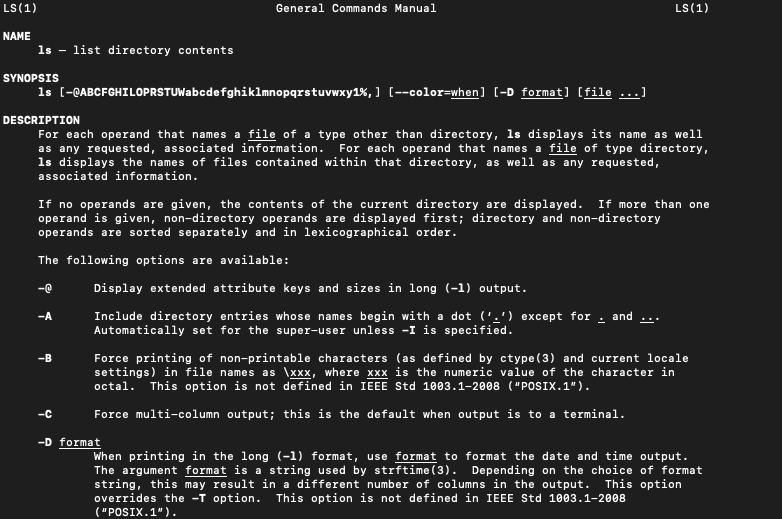

# Unix Commands

## Using Bash on Mac Terminal

#### Learning Objectives

- Learners will understand how to open the command line - terminal on mac
- Learners will become familiar with the most common commands.

#### Mac Terminal

The Terminal on Mac can be open in one of three ways, Finder, Launch Pad and Spotlight.

#### Finder

1.  Scroll to the bottom on your desktop and click on the Finder icon
2.  Click on Applications on the left hand side
3.  Locate the folder called Utilities and expand it
4.  The Terminal app should be visible, click it to open

#### Launch Pad

1.  Press the F4 command
2.  Launch Pad view will appear
3.  In the search bar, click it and type the word Term - short for terminal
4.  The Terminal icon will appear on screen
5.  Click to open

#### Spotlight

1.  Press the Command Key and the Space Bar
2.  The Spotlight modal will appear
3.  Type in the word Terminal or Term for short
4.  The Terminal icon will appear
5.  Click to open

#### Bash commands

Bash provides a list of commands that helps you navigate through files, view contents of files and also edit features to change or update the contents of a file. Below is a list of the most common commands:

| **Command** | **Used for**                                                                 |
| ----------- | ---------------------------------------------------------------------------- |
| `cd`        | Change Directory                                                             |
| `ls`        | List command used for showing the content of a directory.                    |
| `rm`        | Remove command used for removing a file or a directory                       |
| `mv`        | Used to move files or folders to another location                            |
| `touch`     | Allows creating of a new empty file or to upate a timestamp on a file        |
| `cp`        | Used to make a copy of a file or folder                                      |
| `mkdir`     | Make a new directory                                                         |
| `pwd`       | Print work directory, shows the current location in the shell                |
| `cat`       | Allows reading or concatenation of a file                                    |
| `less`      | Displays the contents of a file one page at a time.                          |
| `grep`      | Global regular expression, allows for searching contents of files or folders |

#### Flags

Every bash command has flags which will allow you to change the output of the command itself. For example, the **ls** command is used to print out the list of contents inside a directory. If we wanted to show the list in a different view, we simply need to add a flag such as **-l**.


When the flag of **-l** is passed it will show the output in a different way:


#### Man Pages

When first starting to learn commands from bash it can feel a bit dauting. Luckily every command comes with its own manual or man pages for short. The man page will list all the flags and options that a particular command has to offer. Again, lets use the **ls** command to demonstrate this. Type the following:

```bash
man ls
```



The man pages are a great way to recall the different flags that are available and a great tool in your arsenal to becoming more fluent in bash.

#### Editing

To edit files in bash you have quiet a few options. The most common though is usually VI or Vim. VI stands for visual editor and it allows you to make edits and changes to a file and save them. Its very similar to what you may have used in applications like word. VIM is a better version of VI with some improvements - hense its name visual editor improved. Learning the different commands in Vim will feel a bit different coming from GUI applications but once you practice it will feel like second nature. Vim uses modes to determine the commands you can work with:

- Normal mode: Default mode
- Insert mode: Allows the contents of the files to be edited.
- Command line mode: Normal commands begin with **:**

---

```bash
ls -l /bin/usr > /tmp/error.txt
## ls: /bin/usr: No such file or directory
```

```bash
ls -l /bin/usr 2> /tmp/error.txt
cat /tmp/error.txt
## ls: /bin/usr: No such file or directory
```

---

## Additional Resources

**Agile methodologies**

[**https://www.planview.com/resources/guide/agile-methodologies-a-beginners-guide/**](https://www.planview.com/resources/guide/agile-methodologies-a-beginners-guide/)

**Installing git on mac and windows, detailed instructions.**

[**https://git-scm.com/book/en/v2/Getting-Started-Installing-Git**](https://git-scm.com/book/en/v2/Getting-Started-Installing-Git "getting started installing git")

**Bash Reference Manual**

[https://www.gnu.org/software/bash/manual/html_node/index.html#SEC_Contents](https://www.gnu.org/software/bash/manual/html_node/index.html#SEC_Contents)

**Bash Redirections**

[https://www.gnu.org/software/bash/manual/html_node/Redirections.html#Redirections](https://www.gnu.org/software/bash/manual/html_node/Redirections.html#Redirections)

**Bash Cheatsheet**

[https://devhints.io/bash](https://devhints.io/bash "https://devhints.io/bash")

**Grep Cheatsheet**

[https://devhints.io/grep](https://devhints.io/grep)

**Grep Manual**

[https://man7.org/linux/man-pages/man1/grep.1.html](https://man7.org/linux/man-pages/man1/grep.1.html)

**History and Timeline of Unix**

[https://unix.org/what_is_unix/history_timeline.html](https://unix.org/what_is_unix/history_timeline.html)

**History of Vim**

[https://en.wikipedia.org/wiki/Vim\_(text_editor)](<https://en.wikipedia.org/wiki/Vim_(text_editor)>)

**How to work with relative and absolute paths**

[**https://www.geeksforgeeks.org/absolute-relative-pathnames-unix/**](https://www.geeksforgeeks.org/absolute-relative-pathnames-unix/)

**Unix Commands Cheatsheet**

[https://cheatography.com/jluis/cheat-sheets/bash-and-unix-commands/](https://cheatography.com/jluis/cheat-sheets/bash-and-unix-commands/)

**Vim Cheatsheet**

[https://vim.rtorr.com/](https://vim.rtorr.com/)
